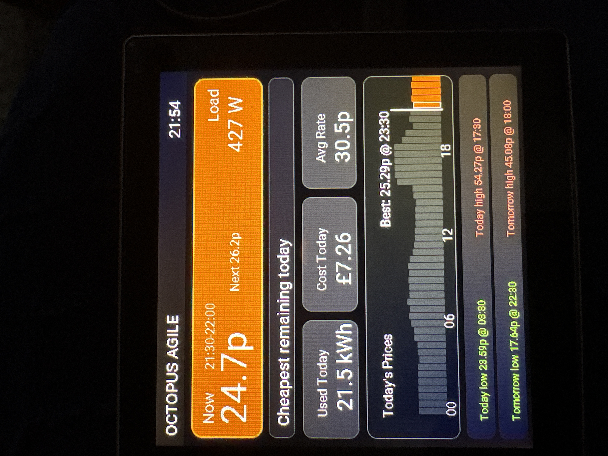

# Agile Energy Display

A real-time Octopus Agile electricity price display for ESP32-S3 devices, built with [ESPHome](https://esphome.io/) and [LVGL](https://lvgl.io/). Shows live rates, today's price chart, current usage, daily cost, and tomorrow's rates at a glance — all on a 480×480 touchscreen display.



---

## Features

- **Live rate** — current and next half-hour slot price, colour-coded by band
- **Contextual advice** — plain-English guidance based on current rate vs the rest of the day
- **Today's price chart** — all 48 half-hour slots, colour-coded, with a "now" marker
- **Daily stats** — energy used (kWh), cost (£), and average rate
- **Tomorrow's prices** — full chart plus low, high, average, best 2-hour window, and peak window (tap main screen to view)
- **Auto-brightness** — dims at night, wakes on touch
- **3 relay outputs** — available for your own automations

---

## Rate Band Colours

| Colour | Range | Meaning |
|---|---|---|
| 🔵 Blue | Negative | You're being paid to use electricity |
| 🟢 Light green | 0 – 12p | Very cheap |
| 🟩 Dark green | 12 – 25p | Below price cap |
| 🟠 Amber | 25 – 35p | Above price cap |
| 🔴 Red | 35p+ | Peak pricing |

---

## Hardware

This project is designed for the **ESP32-4848S040C_1**, sold on AliExpress as the **"ESP32 4.0 inch capacitive touch"** display board (made by Sunton). Search for `ESP32-4848S040C` to find it.

| Feature | Detail |
|---|---|
| Model | ESP32-4848S040C_1 |
| SoC | ESP32-S3 |
| Display | 480×480 ST7701S RGB panel |
| Touch | GT911 capacitive |
| PSRAM | Octal, 80 MHz |
| Relays | 3× GPIO (GPIO40, GPIO2, GPIO1) |
| Backlight | PWM on GPIO38 |

Other ESP32-S3 boards with the same display controller and pinout should work with little or no modification.

---

## Requirements

- [Octopus Energy integration](https://github.com/BottlecapDave/HomeAssistant-OctopusEnergy) for Home Assistant, configured and providing Agile rate data
- ESPHome 2024.6 or later (for LVGL support)
- The device must be on the same network as your Home Assistant instance

---

## Getting Started

See **[docs/Setup.md](docs/Setup.md)** for the full installation walkthrough, covering:

- Installing ESPHome
- Finding your meter serial and MPAN
- Adding the Home Assistant template sensors
- Configuring and flashing the device
- Verifying the display is working
- Running multiple devices across multiple locations
- Customisation (brightness, night mode hours, display rotation)
- Troubleshooting

---

## Repository Structure

```
agile-energy-display/
├── README.md
├── esphome/
│   └── agile-energy-display.yaml    # Full ESPHome configuration
├── homeassistant/
│   └── templates.yaml               # Required HA template sensors
└── docs/
    ├── setup.md                     # Full installation and configuration guide
    └── images/
        └── screenshot.jpg
```

The **only files you need to edit** are the `substitutions` block at the top of `esphome/agile-energy-display.yaml`, and the `SERIAL`/`MPAN` placeholders in `homeassistant/templates.yaml`. Everything else works as-is.

---

## Acknowledgements

- [BottlecapDave](https://github.com/BottlecapDave) for the excellent Home Assistant Octopus Energy integration
- [ESPHome](https://esphome.io/) and [LVGL](https://lvgl.io/) for making embedded UI this approachable

---

## Licence

MIT — free to use, modify, and distribute. Attribution appreciated but not required.